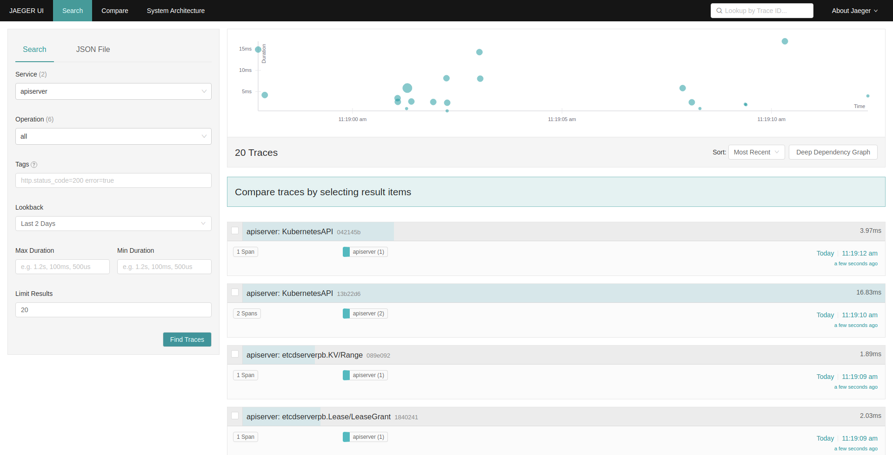

# Summary

Deploy k8s cluster enabled [kube-apiserver trace feature gate](https://kubernetes.io/docs/concepts/cluster-administration/system-traces/) by [kind](https://kind.sigs.k8s.io/).  
Please see [descriptions(keyword: APIServerTracing)](https://github.com/kubernetes/kubernetes/blob/master/CHANGELOG/CHANGELOG-1.22.md#api-change) at CHANGELOG-1.22.md and [PR #94942](https://github.com/kubernetes/kubernetes/pull/94942) on kubernetes repository.



# Prerequisite

- Commands needed:
  - `kind`
  - `docker-compose`

# Usage

## Run

- Up cluster
```
IP=<IP addres of host machine> make run
```
- Check k8s cluster up
```
kubectl get nodes
```
- Access to Jaeger UI at http://0.0.0.0:16686/
- You can select Service "apiserer" at left top select box and push "Find Traces" button.

## Stop
```
make stop
```

# System Components Layout


